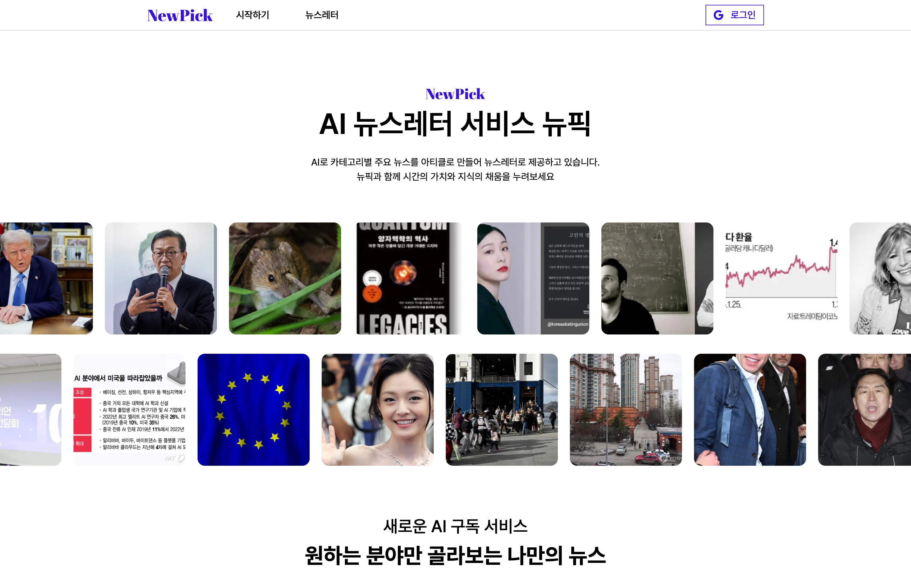

## 🗞️ 맞춤형 AI 뉴스레터 서비스 뉴픽



[Newpick 체험하기](https://www.newpick.site/)


---

## 프로젝트 소개
Newpick은 사용자가 선택한 관심사 기반으로 맞춤형 뉴스레터 서비스 입니다. 
<br/>
최신 뉴스를 크롤링한 후, OpenAI API를 활용하여 AI 기반으로 요약된 뉴스레터를 생성합니다.
<br/>
웹 서비스에서는 제작된 뉴스레터를 제공하며,
<br/>
관심사를 구독한 유저에게 데일리 뉴스레터를 받아볼 수 있는 서비스를 제공합니다. 

### **핵심 기능**

- **AI 뉴스 요약**: OpenAI API를 활용하여 뉴스 요약 생성
- **카테고리별 뉴스 필터링**: 사용자가 관심 있는 뉴스만 조회 가능
- **개인화 추천 뉴스**: 구독한 유저의 카테고리에 따라 뉴스레터 제공
- **데일리 뉴스레터 발송**: 매일 오전 8시 뉴스레터 요약 이메일 발송
- **구독 관리**: 사용자별 뉴스 구독 및 취소 관리

---
## 팀원 구성

|                                      김정현                                      |                                    이주현                                    |
|:-----------------------------------------------------------------------------:|:-------------------------------------------------------------------------:|
|                               기획, 유저인증, API 연동                                |                            와이어프레임, 디자인, API 연동                            |
|  |  |
|                 [@CodingKirby](https://github.com/mong-head)                  |                 [@jayl100](https://github.com/dntjd7701)                  |


---

## 기술 스택

 | SSR 및 클라이언트 사이드 렌더링 


**Typescript** | 타입 안전성


**Zustand** | API 상태 관리 (데이터 캐싱)


**React Query** | 전역 상태 관리


**Styled-components** | UI 스타일링


  | 프론트엔드 배포


| 프로젝트 버전 상태관리


**Notion** | 진행상황 체크 협업 도구

---
## 개발 기간
전체 개발 기간
<br/>`2024-12-26 ~ 2025-02-05`

- `2024-12-26 ~ 2024-12-28` 프로젝트 주제 선정 및 기획
- `2024-12-28 ~ 2025-01-04` 기능정의, 와이어프레임, 디자인 진행
- `2025-01-04 ~ 2025-01-08` 초기 셋팅 (Next.js 셋팅, 공통 컴포넌트)
- `2025-01-08 ~ 2025-01-20` UI 설계 진행
- `2025-01-21 ~ 2025-01-31` API 연동
- `2025-02-01 ~ 2025-02-05` Vercel 배포 완료 및 에러 처리

---

## 디렉토리 구조
```bash
├── public
└── src
    ├── api # fetch Api 구성
    ├── app
    │   ├── (home) # 메인페이지 디렉토리
    │   ├── (protected) # 마이페이지 protected 설정
    │   │   └── mypage
    │   ├── about
    │   └── articles
    │       ├── (main)
    │       └── detail
    │           └── [slug] # 뉴스레터 디테일 페이지
    │                   └── content
    ├── components
    │   ├── common # 공통 컴포넌트
    │   ├── layout # 사이트 전체 공통 레이아웃 
    │   │   └── header # 사이트 적용 헤더
    │   └── providers # 테마, 유저, 전역관리 Provider
    ├── constants # 상수 적용 파일 관리
    ├── hooks # 훅 관리
    ├── lib # 기타 기술 파일
    ├── mocks # 더미 데이터 및 Json 서버 데이터
    ├── models # typescript 타입 정의
    ├── stores # zustand 전역 상태 관리
    ├── styles # global 스타일과 테마 관리
    └── utils # 기타 사용 함수 관리


```
